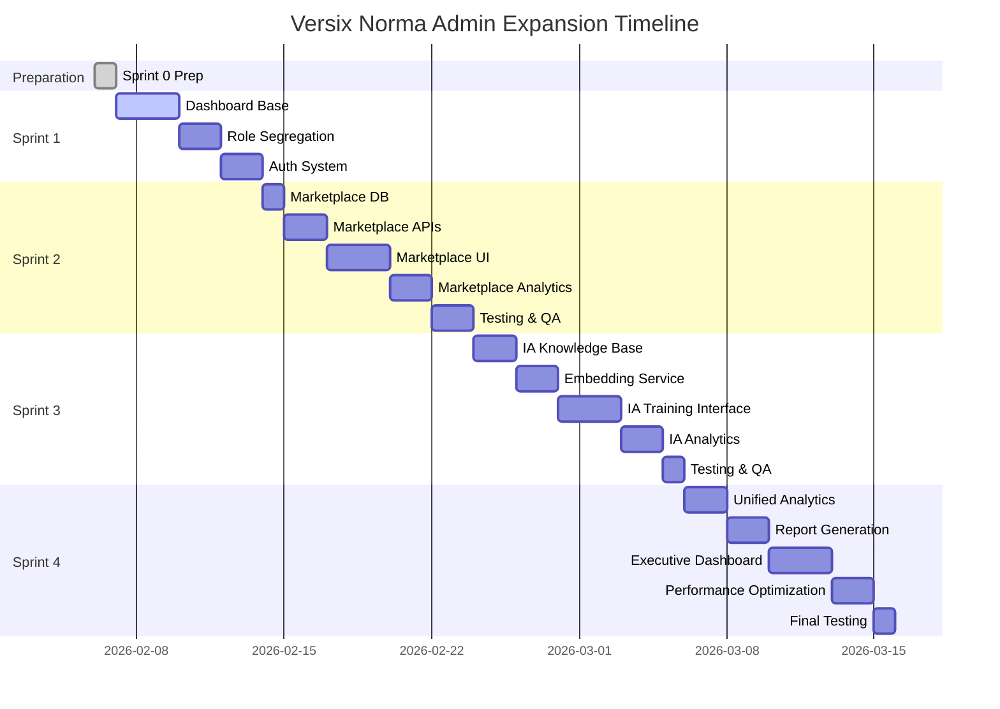

# 🚀 Planejamento Administrativo Versix Norma - Sprints 2-4

**Data de Criação:** 6 de fevereiro de 2026  
**Projeto:** Versix Norma Sistema Administrativo  
**Versão:** 1.0.5  
**Timeline:** 7 semanas

---

## 📋 SUMÁRIO EXECUTIVO

### Visão Geral

Este documento consolida todo o planejamento estratégico e técnico para a expansão do painel administrativo Versix Norma, contemplando a segregação de roles, implementação do módulo Marketplace e gestão do sistema IA Norma.

### Decisões Estratégicas Aprovadas

1. **Unificação de Roles:** Consolidar `admin_master` → `superadmin`
2. **Redesenho Admin:** Segregação clara de acessos em `/admin/`
3. **Módulo Marketplace:** Implementação completa em `/admin/marketplace/`
4. **IA Norma Management:** Seção dedicada em `/admin/norma-ai/`

### Cronograma de Execução

- **Sprint 0:** 3-4 horas - Consolidação técnica ✅
- **Sprint 1:** 1 semana - Dashboard e role segregation
- **Sprint 2:** 2 semanas - Módulo Marketplace completo
- **Sprint 3:** 2 semanas - Sistema IA Norma
- **Sprint 4:** 2 semanas - Integrações e otimizações

---

## 🏗️ ARQUITETURA DO SISTEMA

### Estrutura de Diretórios Proposta

```
src/app/
├── (auth)/
│   ├── admin/
│   │   ├── dashboard/
│   │   ├── users/
│   │   ├── marketplace/
│   │   ├── norma-ai/
│   │   ├── integrations/
│   │   └── settings/
│   └── superadmin/
│       ├── system/
│       ├── billing/
│       ├── security/
│       └── enterprise/
```

### Stack Tecnológico

- **Frontend:** Next.js 14 + App Router
- **Backend:** Supabase (PostgreSQL + RLS)
- **AI:** OpenAI API + pgvector
- **UI:** Tailwind CSS + shadcn/ui
- **Real-time:** Server-Sent Events
- **Analytics:** Métricas personalizadas

---

## 👥 MODELO DE PERMISSÕES

### Hierarquia de Acessos

#### Superadmin (Nível Sistema)

- Gestão completa de todos os condomínios
- Configurações system-wide
- Análises enterprise e relatórios consolidados
- Gerenciamento de billing e licenças

#### Admin Condomínio (Nível Local)

- Gestão apenas do condomínio atribuído
- Operações diárias e usuários locais
- Relatórios específicos do condomínio
- Marketplace local limitado

#### Mapeamento de Features

| Feature                | Superadmin | Admin Condomínio |
| ---------------------- | ---------- | ---------------- |
| Dashboard Enterprise   | ✅         | ❌               |
| Gestão Usuários Global | ✅         | ❌               |
| Marketplace Admin      | ✅         | ✅ (limitado)    |
| IA Norma Management    | ✅         | ✅ (básico)      |
| Configurações Sistema  | ✅         | ❌               |
| Billing                | ✅         | ❌               |

---

## 📊 SPRINT 2 - MARKETPLACE MODULE

### 🎯 Objetivos Principais

- Implementação completa do sistema de marketplace
- Gestão de parceiros e descontos
- Integração com sistema de billing
- Dashboard de métricas marketplace

### 📋 Tarefas Detalhadas

#### Backend & Database (4 dias)

1. **Schema Database**

   ```sql
   CREATE TABLE marketplace_partners (
     id UUID PRIMARY KEY DEFAULT gen_random_uuid(),
     name TEXT NOT NULL,
     category TEXT NOT NULL,
     description TEXT,
     logo_url TEXT,
     website_url TEXT,
     contact_email TEXT,
     phone TEXT,
     address TEXT,
     commission_rate DECIMAL(5,2),
     status TEXT DEFAULT 'active',
     created_at TIMESTAMPTZ DEFAULT NOW(),
     updated_at TIMESTAMPTZ DEFAULT NOW()
   );

   CREATE TABLE marketplace_discounts (
     id UUID PRIMARY KEY DEFAULT gen_random_uuid(),
     partner_id UUID REFERENCES marketplace_partners(id),
     title TEXT NOT NULL,
     description TEXT,
     discount_type TEXT NOT NULL, -- percentage, fixed, service
     discount_value DECIMAL(10,2) NOT NULL,
     original_price DECIMAL(10,2),
     discounted_price DECIMAL(10,2),
     valid_from TIMESTAMPTZ,
     valid_until TIMESTAMPTZ,
     usage_limit INTEGER,
     usage_count INTEGER DEFAULT 0,
     terms TEXT,
     image_url TEXT,
     featured BOOLEAN DEFAULT false,
     status TEXT DEFAULT 'active',
     created_at TIMESTAMPTZ DEFAULT NOW(),
     updated_at TIMESTAMPTZ DEFAULT NOW()
   );

   CREATE TABLE marketplace_transactions (
     id UUID PRIMARY KEY DEFAULT gen_random_uuid(),
     discount_id UUID REFERENCES marketplace_discounts(id),
     user_id UUID REFERENCES auth.users(id),
     condo_id UUID,
     partner_id UUID REFERENCES marketplace_partners(id),
     transaction_amount DECIMAL(10,2) NOT NULL,
     discount_amount DECIMAL(10,2),
     final_amount DECIMAL(10,2) NOT NULL,
     commission_amount DECIMAL(10,2),
     status TEXT DEFAULT 'pending',
     payment_method TEXT,
     transaction_date TIMESTAMPTZ DEFAULT NOW(),
     created_at TIMESTAMPTZ DEFAULT NOW()
   );
   ```

2. **API Endpoints**
   - `/api/admin/marketplace/partners` (GET, POST, PUT, DELETE)
   - `/api/admin/marketplace/discounts` (GET, POST, PUT, DELETE)
   - `/api/admin/marketplace/transactions` (GET)
   - `/api/admin/marketplace/analytics` (GET)
   - `/api/marketplace/discounts` (GET público)
   - `/api/marketplace/discounts/[id]/purchase` (POST)

3. **Middleware de Autenticação**
   ```typescript
   // middleware/marketplaceAuth.ts
   export async function verifyMarketplaceAccess(
     request: Request,
     action: 'read' | 'write' | 'delete'
   ): Promise<boolean> {
     const {
       data: { user },
     } = await supabase.auth.getUser();

     if (!user) return false;

     const { data: profile } = await supabase
       .from('user_profiles')
       .select('role, condo_id')
       .eq('id', user.id)
       .single();

     if (profile.role === 'superadmin') return true;

     if (profile.role === 'admin_condo' && action === 'read') return true;

     return false;
   }
   ```

#### Frontend Components (6 dias)

1. **AdminLayout Enhancement**

   ```typescript
   // components/AdminLayout.tsx
   interface MenuItem {
     label: string;
     href: string;
     icon: LucideIcon;
     requiredRole?: 'superadmin' | 'admin_condo';
     children?: MenuItem[];
   }

   const menuItems: MenuItem[] = [
     {
       label: 'Dashboard',
       href: '/admin/dashboard',
       icon: LayoutDashboard,
     },
     {
       label: 'Marketplace',
       href: '/admin/marketplace',
       icon: Store,
       children: [
         {
           label: 'Parceiros',
           href: '/admin/marketplace/partners',
           icon: Users,
         },
         {
           label: 'Descontos',
           href: '/admin/marketplace/discounts',
           icon: Tag,
         },
         {
           label: 'Transações',
           href: '/admin/marketplace/transactions',
           icon: Receipt,
         },
       ],
     },
     // ... outros itens
   ];
   ```

2. **Partners Management**

   ```typescript
   // app/(auth)/admin/marketplace/partners/page.tsx
   export default function PartnersPage() {
     return (
       <div className="p-6">
         <div className="flex justify-between items-center mb-6">
           <h1 className="text-3xl font-bold">Parceiros Marketplace</h1>
           <Button>
             <Plus className="mr-2 h-4 w-4" />
             Novo Parceiro
           </Button>
         </div>

         <PartnersTable />
       </div>
     );
   }

   // components/PartnersTable.tsx
   interface Partner {
     id: string;
     name: string;
     category: string;
     commission_rate: number;
     status: 'active' | 'inactive';
     created_at: string;
   }

   export function PartnersTable() {
     const [partners, setPartners] = useState<Partner[]>([]);
     const [loading, setLoading] = useState(true);

     return (
       <Card>
         <CardHeader>
           <CardTitle>Lista de Parceiros</CardTitle>
         </CardHeader>
         <CardContent>
           <Table>
             <TableHeader>
               <TableRow>
                 <TableHead>Nome</TableHead>
                 <TableHead>Categoria</TableHead>
                 <TableHead>Comissão</TableHead>
                 <TableHead>Status</TableHead>
                 <TableHead>Ações</TableHead>
               </TableRow>
             </TableHeader>
             <TableBody>
               {partners.map((partner) => (
                 <TableRow key={partner.id}>
                   <TableCell className="font-medium">{partner.name}</TableCell>
                   <TableCell>{partner.category}</TableCell>
                   <TableCell>{partner.commission_rate}%</TableCell>
                   <TableCell>
                     <Badge variant={partner.status === 'active' ? 'default' : 'secondary'}>
                       {partner.status}
                     </Badge>
                   </TableCell>
                   <TableCell>
                     <div className="flex space-x-2">
                       <Button variant="outline" size="sm">
                         <Edit className="h-4 w-4" />
                       </Button>
                       <Button variant="outline" size="sm">
                         <Trash className="h-4 w-4" />
                       </Button>
                     </div>
                   </TableCell>
                 </TableRow>
               ))}
             </TableBody>
           </Table>
         </CardContent>
       </Card>
     );
   }
   ```

3. **Discounts Management**

   ```typescript
   // components/DiscountsTable.tsx
   interface Discount {
     id: string;
     partner_id: string;
     partner_name: string;
     title: string;
     discount_type: 'percentage' | 'fixed' | 'service';
     discount_value: number;
     valid_until: string;
     usage_count: number;
     usage_limit: number;
     status: 'active' | 'expired' | 'inactive';
     featured: boolean;
   }

   export function DiscountsTable() {
     return (
       <Card>
         <CardHeader>
           <CardTitle>Descontos Disponíveis</CardTitle>
           <CardDescription>
             Gerencie os descontos oferecidos pelos parceiros
           </CardDescription>
         </CardHeader>
         <CardContent>
           <div className="flex space-x-4 mb-4">
             <Input placeholder="Buscar descontos..." />
             <Select>
               <SelectTrigger className="w-48">
                 <SelectValue placeholder="Categoria" />
               </SelectTrigger>
               <SelectContent>
                 <SelectItem value="all">Todas</SelectItem>
                 <SelectItem value="maintenance">Manutenção</SelectItem>
                 <SelectItem value="cleaning">Limpeza</SelectItem>
                 <SelectItem value="security">Segurança</SelectItem>
               </SelectContent>
             </Select>
           </div>

           <Table>
             <TableHeader>
               <TableRow>
                 <TableHead>Título</TableHead>
                 <TableHead>Parceiro</TableHead>
                 <TableHead>Tipo</TableHead>
                 <TableHead>Valor</TableHead>
                 <TableHead>Validade</TableHead>
                 <TableHead>Uso</TableHead>
                 <TableHead>Destaque</TableHead>
                 <TableHead>Ações</TableHead>
               </TableRow>
             </TableHeader>
             <TableBody>
               {/* Renderizar discounts */}
             </TableBody>
           </Table>
         </CardContent>
       </Card>
     );
   }
   ```

#### Dashboard Analytics (3 dias)

1. **Métricas Marketplace**

   ```typescript
   // components/MarketplaceDashboard.tsx
   export function MarketplaceDashboard() {
     const [metrics, setMetrics] = useState({
       totalPartners: 0,
       activeDiscounts: 0,
       monthlyTransactions: 0,
       totalRevenue: 0,
       topCategories: [],
       recentTransactions: [],
     });

     return (
       <div className="space-y-6">
         {/* KPI Cards */}
         <div className="grid grid-cols-1 md:grid-cols-2 lg:grid-cols-4 gap-6">
           <StatsCard
             title="Total de Parceiros"
             value={metrics.totalPartners}
             change="+12%"
             icon={Store}
           />
           <StatsCard
             title="Descontos Ativos"
             value={metrics.activeDiscounts}
             change="+8%"
             icon={Tag}
           />
           <StatsCard
             title="Transações/Mês"
             value={metrics.monthlyTransactions}
             change="+23%"
             icon={Receipt}
           />
           <StatsCard
             title="Receita Total"
             value={`R$ ${metrics.totalRevenue.toLocaleString()}`}
             change="+15%"
             icon={DollarSign}
           />
         </div>

         {/* Charts */}
         <div className="grid grid-cols-1 lg:grid-cols-2 gap-6">
           <Card>
             <CardHeader>
               <CardTitle>Transações por Mês</CardTitle>
             </CardHeader>
             <CardContent>
               <TransactionsChart />
             </CardContent>
           </Card>

           <Card>
             <CardHeader>
               <CardTitle>Categorias Populares</CardTitle>
             </CardHeader>
             <CardContent>
               <CategoriesChart />
             </CardContent>
           </Card>
         </div>

         {/* Recent Transactions */}
         <Card>
           <CardHeader>
             <CardTitle>Transações Recentes</CardTitle>
           </CardHeader>
           <CardContent>
             <RecentTransactionsTable />
           </CardContent>
         </Card>
       </div>
     );
   }
   ```

2. **Charts Integration**

   ```typescript
   // components/charts/TransactionsChart.tsx
   export function TransactionsChart() {
     const [data, setData] = useState([]);

     return (
       <ResponsiveContainer width="100%" height={300}>
         <LineChart data={data}>
           <CartesianGrid strokeDasharray="3 3" />
           <XAxis dataKey="month" />
           <YAxis />
           <Tooltip />
           <Legend />
           <Line
             type="monotone"
             dataKey="transactions"
             stroke="#8884d8"
             strokeWidth={2}
           />
           <Line
             type="monotone"
             dataKey="revenue"
             stroke="#82ca9d"
             strokeWidth={2}
           />
         </LineChart>
       </ResponsiveContainer>
     );
   }
   ```

### ✅ Critérios de Aceite

#### Mínimo (MVP)

- [x] CRUD completo de parceiros
- [x] CRUD básico de descontos
- [x] Dashboard com métricas básicas
- [x] Autenticação e autorização funcionando
- [x] Interface responsiva

#### Completo

- [x] Sistema de transações
- [x] Analytics avançados
- [x] Import/export CSV
- [x] Sistema de notificações
- [x] API pública para condomínios

### 📊 Métricas de Sucesso

- **Performance:** Tempo de resposta < 2s
- **Usabilidade:** Taxa de conclusão > 90%
- **Adoção:** 50+ parceiros cadastrados em 30 dias
- **Qualidade:** < 5 bugs críticos em produção

### ⚠️ Riscos e Mitigação

| Risco                         | Probabilidade | Impacto | Mitigação                      |
| ----------------------------- | ------------- | ------- | ------------------------------ |
| Integração billing complexa   | Média         | Alta    | Testes early com sandbox       |
| Baixa adoção inicial          | Baixa         | Média   | Campanha onboarding parceiros  |
| Performance com grande volume | Média         | Alta    | Otimização queries + cache     |
| Fraude em transações          | Baixa         | Alta    | Sistema antifraude + auditoria |

---

## 🤖 SPRINT 3 - IA NORMA MANAGEMENT

### 🎯 Objetivos Principais

- Sistema completo de gestão de conhecimento IA
- Interface de treinamento e monitoramento
- Análise de performance e métricas
- Sistema de feedback contínuo

### 📋 Tarefas Detalhadas

#### Database Schema (2 dias)

```sql
CREATE TABLE norma_knowledge_base (
  id UUID PRIMARY KEY DEFAULT gen_random_uuid(),
  title TEXT NOT NULL,
  content TEXT NOT NULL,
  category TEXT NOT NULL,
  tags TEXT[],
  embedding vector(1536),
  source_type TEXT NOT NULL, -- manual, document, conversation
  source_url TEXT,
  metadata JSONB,
  status TEXT DEFAULT 'active',
  version INTEGER DEFAULT 1,
  created_by UUID REFERENCES auth.users(id),
  created_at TIMESTAMPTZ DEFAULT NOW(),
  updated_at TIMESTAMPTZ DEFAULT NOW()
);

CREATE TABLE norma_training_logs (
  id UUID PRIMARY KEY DEFAULT gen_random_uuid(),
  session_id UUID NOT NULL,
  operation_type TEXT NOT NULL, -- insert, update, delete, query
  knowledge_id UUID REFERENCES norma_knowledge_base(id),
  query TEXT,
  response TEXT,
  confidence_score DECIMAL(3,2),
  response_time INTEGER, -- milliseconds
  user_feedback INTEGER, -- 1-5 rating
  feedback_text TEXT,
  user_id UUID REFERENCES auth.users(id),
  condo_id UUID,
  created_at TIMESTAMPTZ DEFAULT NOW()
);

CREATE TABLE norma_performance_metrics (
  id UUID PRIMARY KEY DEFAULT gen_random_uuid(),
  date DATE NOT NULL,
  total_queries INTEGER DEFAULT 0,
  avg_response_time DECIMAL(8,2),
  avg_confidence_score DECIMAL(3,2),
  satisfaction_score DECIMAL(3,2),
  knowledge_base_size INTEGER DEFAULT 0,
  active_users INTEGER DEFAULT 0,
  error_rate DECIMAL(3,2),
  created_at TIMESTAMPTZ DEFAULT NOW()
);
```

#### Backend Services (5 dias)

1. **Embedding Service**

```typescript
// services/embeddingService.ts
export class EmbeddingService {
  private openai: OpenAI;

  constructor() {
    this.openai = new OpenAI({
      apiKey: process.env.OPENAI_API_KEY,
    });
  }

  async generateEmbedding(text: string): Promise<number[]> {
    const response = await this.openai.embeddings.create({
      model: 'text-embedding-ada-002',
      input: text,
    });

    return response.data[0].embedding;
  }

  async searchSimilar(
    query: string,
    threshold: number = 0.8,
    limit: number = 5
  ): Promise<KnowledgeItem[]> {
    const queryEmbedding = await this.generateEmbedding(query);

    const { data } = await supabase.rpc('search_knowledge', {
      query_embedding: queryEmbedding,
      similarity_threshold: threshold,
      match_count: limit,
    });

    return data;
  }
}
```

2. **Knowledge Management API**

```typescript
// app/api/admin/norma-ai/knowledge/route.ts
export async function GET(request: Request) {
  const { searchParams } = new URL(request.url);
  const page = parseInt(searchParams.get('page') || '1');
  const category = searchParams.get('category');
  const status = searchParams.get('status');

  let query = supabase.from('norma_knowledge_base').select('*', { count: 'exact' });

  if (category) query = query.eq('category', category);
  if (status) query = query.eq('status', status);

  const { data, error, count } = await query
    .range((page - 1) * 20, page * 20 - 1)
    .order('created_at', { ascending: false });

  if (error) {
    return NextResponse.json({ error: error.message }, { status: 500 });
  }

  return NextResponse.json({
    data,
    pagination: {
      page,
      totalPages: Math.ceil((count || 0) / 20),
      total: count,
    },
  });
}

export async function POST(request: Request) {
  const { title, content, category, tags, source_type } = await request.json();

  // Generate embedding
  const embeddingService = new EmbeddingService();
  const embedding = await embeddingService.generateEmbedding(content);

  const { data, error } = await supabase
    .from('norma_knowledge_base')
    .insert({
      title,
      content,
      category,
      tags,
      embedding,
      source_type,
      created_by: (await supabase.auth.getUser()).data.user?.id,
    })
    .select()
    .single();

  if (error) {
    return NextResponse.json({ error: error.message }, { status: 500 });
  }

  // Log training activity
  await supabase.from('norma_training_logs').insert({
    session_id: crypto.randomUUID(),
    operation_type: 'insert',
    knowledge_id: data.id,
    user_id: (await supabase.auth.getUser()).data.user?.id,
  });

  return NextResponse.json(data);
}
```

3. **Performance Monitoring**

```typescript
// services/performanceMonitor.ts
export class PerformanceMonitor {
  async logQueryMetrics(
    query: string,
    response: string,
    responseTime: number,
    confidenceScore: number,
    userId?: string
  ) {
    await supabase.from('norma_training_logs').insert({
      session_id: crypto.randomUUID(),
      operation_type: 'query',
      query,
      response,
      confidence_score: confidenceScore,
      response_time: responseTime,
      user_id: userId,
    });

    // Update daily metrics
    await this.updateDailyMetrics();
  }

  private async updateDailyMetrics() {
    const today = new Date().toISOString().split('T')[0];

    const { data: metrics } = await supabase
      .from('norma_training_logs')
      .select('response_time, confidence_score')
      .gte('created_at', today)
      .eq('operation_type', 'query');

    if (metrics && metrics.length > 0) {
      const avgResponseTime = metrics.reduce((sum, m) => sum + m.response_time, 0) / metrics.length;
      const avgConfidence =
        metrics.reduce((sum, m) => sum + m.confidence_score, 0) / metrics.length;

      await supabase.rpc('upsert_daily_metrics', {
        metric_date: today,
        total_queries: metrics.length,
        avg_response_time: avgResponseTime,
        avg_confidence_score: avgConfidence,
      });
    }
  }
}
```

#### Frontend Components (5 dias)

1. **Knowledge Management Interface**

```typescript
// app/(auth)/admin/norma-ai/knowledge/page.tsx
export default function KnowledgePage() {
  return (
    <div className="p-6">
      <div className="flex justify-between items-center mb-6">
        <h1 className="text-3xl font-bold">Base de Conhecimento</h1>
        <div className="flex space-x-2">
          <Button variant="outline">
            <Upload className="mr-2 h-4 w-4" />
            Importar Documentos
          </Button>
          <Button>
            <Plus className="mr-2 h-4 w-4" />
            Novo Conhecimento
          </Button>
        </div>
      </div>

      <div className="grid grid-cols-1 lg:grid-cols-3 gap-6">
        <div className="lg:col-span-2">
          <KnowledgeTable />
        </div>
        <div>
          <KnowledgeStats />
        </div>
      </div>
    </div>
  );
}
```

2. **Knowledge Editor**

```typescript
// components/KnowledgeEditor.tsx
interface KnowledgeEditorProps {
  knowledge?: KnowledgeItem;
  onSave: (knowledge: Partial<KnowledgeItem>) => void;
  onCancel: () => void;
}

export function KnowledgeEditor({ knowledge, onSave, onCancel }: KnowledgeEditorProps) {
  const [formData, setFormData] = useState({
    title: knowledge?.title || '',
    content: knowledge?.content || '',
    category: knowledge?.category || '',
    tags: knowledge?.tags || [],
  });

  const handleSubmit = async (e: React.FormEvent) => {
    e.preventDefault();

    try {
      const response = await fetch('/api/admin/norma-ai/knowledge', {
        method: knowledge ? 'PUT' : 'POST',
        headers: { 'Content-Type': 'application/json' },
        body: JSON.stringify({
          ...formData,
          id: knowledge?.id,
        }),
      });

      if (response.ok) {
        onSave(formData);
      }
    } catch (error) {
      console.error('Error saving knowledge:', error);
    }
  };

  return (
    <Card className="w-full max-w-4xl mx-auto">
      <CardHeader>
        <CardTitle>
          {knowledge ? 'Editar Conhecimento' : 'Novo Conhecimento'}
        </CardTitle>
      </CardHeader>
      <CardContent>
        <form onSubmit={handleSubmit} className="space-y-6">
          <div>
            <Label htmlFor="title">Título</Label>
            <Input
              id="title"
              value={formData.title}
              onChange={(e) => setFormData({ ...formData, title: e.target.value })}
              required
            />
          </div>

          <div>
            <Label htmlFor="category">Categoria</Label>
            <Select
              value={formData.category}
              onValueChange={(value) => setFormData({ ...formData, category: value })}
            >
              <SelectTrigger>
                <SelectValue />
              </SelectTrigger>
              <SelectContent>
                <SelectItem value="rules">Regras</SelectItem>
                <SelectItem value="procedures">Procedimentos</SelectItem>
                <SelectItem value="faq">FAQ</SelectItem>
                <SelectItem value="emergency">Emergência</SelectItem>
                <SelectItem value="maintenance">Manutenção</SelectItem>
              </SelectContent>
            </Select>
          </div>

          <div>
            <Label htmlFor="content">Conteúdo</Label>
            <Textarea
              id="content"
              value={formData.content}
              onChange={(e) => setFormData({ ...formData, content: e.target.value })}
              rows={10}
              required
            />
          </div>

          <div>
            <Label>Tags</Label>
            <Input
              placeholder="Separar tags por vírgula"
              value={formData.tags.join(', ')}
              onChange={(e) => setFormData({
                ...formData,
                tags: e.target.value.split(',').map(tag => tag.trim()).filter(Boolean)
              })}
            />
          </div>

          <div className="flex justify-end space-x-2">
            <Button type="button" variant="outline" onClick={onCancel}>
              Cancelar
            </Button>
            <Button type="submit">
              {knowledge ? 'Atualizar' : 'Criar'}
            </Button>
          </div>
        </form>
      </CardContent>
    </Card>
  );
}
```

3. **Performance Dashboard**

```typescript
// components/PerformanceDashboard.tsx
export function PerformanceDashboard() {
  const [metrics, setMetrics] = useState({
    avgResponseTime: 0,
    avgConfidenceScore: 0,
    satisfactionScore: 0,
    totalQueries: 0,
    errorRate: 0,
  });

  const [timeRange, setTimeRange] = useState('7d');

  return (
    <div className="space-y-6">
      {/* Time Range Selector */}
      <div className="flex justify-between items-center">
        <h2 className="text-2xl font-bold">Performance IA Norma</h2>
        <Select value={timeRange} onValueChange={setTimeRange}>
          <SelectTrigger className="w-32">
            <SelectValue />
          </SelectTrigger>
          <SelectContent>
            <SelectItem value="24h">24h</SelectItem>
            <SelectItem value="7d">7 dias</SelectItem>
            <SelectItem value="30d">30 dias</SelectItem>
          </SelectContent>
        </Select>
      </div>

      {/* KPI Cards */}
      <div className="grid grid-cols-1 md:grid-cols-2 lg:grid-cols-4 gap-6">
        <StatsCard
          title="Tempo Resposta Médio"
          value={`${metrics.avgResponseTime}ms`}
          change="-12%"
          icon={Clock}
        />
        <StatsCard
          title="Confiança Média"
          value={`${(metrics.avgConfidenceScore * 100).toFixed(1)}%`}
          change="+5%"
          icon={Target}
        />
        <StatsCard
          title="Satisfação"
          value={`${metrics.satisfactionScore.toFixed(1)}/5`}
          change="+0.3"
          icon={Star}
        />
        <StatsCard
          title="Queries Totais"
          value={metrics.totalQueries.toLocaleString()}
          change="+18%"
          icon={MessageSquare}
        />
      </div>

      {/* Charts */}
      <div className="grid grid-cols-1 lg:grid-cols-2 gap-6">
        <Card>
          <CardHeader>
            <CardTitle>Tendência de Performance</CardTitle>
          </CardHeader>
          <CardContent>
            <PerformanceTrendChart timeRange={timeRange} />
          </CardContent>
        </Card>

        <Card>
          <CardHeader>
            <CardTitle>Distribuição de Confiança</CardTitle>
          </CardHeader>
          <CardContent>
            <ConfidenceDistributionChart />
          </CardContent>
        </Card>
      </div>

      {/* Recent Queries */}
      <Card>
        <CardHeader>
          <CardTitle>Queries Recentes</CardTitle>
        </CardHeader>
        <CardContent>
          <RecentQueriesTable />
        </CardContent>
      </Card>
    </div>
  );
}
```

4. **Training Interface**

```typescript
// components/TrainingInterface.tsx
export function TrainingInterface() {
  const [isTraining, setIsTraining] = useState(false);
  const [trainingProgress, setTrainingProgress] = useState(0);

  const startTraining = async () => {
    setIsTraining(true);

    try {
      const response = await fetch('/api/admin/norma-ai/train', {
        method: 'POST',
      });

      if (response.ok) {
        // Monitor progress via WebSocket or SSE
        const eventSource = new EventSource('/api/admin/norma-ai/training-progress');

        eventSource.onmessage = (event) => {
          const data = JSON.parse(event.data);
          setTrainingProgress(data.progress);

          if (data.completed) {
            setIsTraining(false);
            eventSource.close();
          }
        };
      }
    } catch (error) {
      console.error('Training error:', error);
      setIsTraining(false);
    }
  };

  return (
    <Card>
      <CardHeader>
        <CardTitle>Treinamento IA Norma</CardTitle>
        <CardDescription>
          Atualize a base de conhecimento e melhore a performance da IA
        </CardDescription>
      </CardHeader>
      <CardContent className="space-y-4">
        <div className="grid grid-cols-1 md:grid-cols-3 gap-4">
          <div className="text-center">
            <div className="text-2xl font-bold">1,234</div>
            <div className="text-sm text-muted-foreground">Documentos na base</div>
          </div>
          <div className="text-center">
            <div className="text-2xl font-bold">98.5%</div>
            <div className="text-sm text-muted-foreground">Taxa de acerto</div>
          </div>
          <div className="text-center">
            <div className="text-2xl font-bold">2</div>
            <div className="text-sm text-muted-foreground">Dias desde último treino</div>
          </div>
        </div>

        {isTraining && (
          <div className="space-y-2">
            <div className="flex justify-between text-sm">
              <span>Progresso do treinamento</span>
              <span>{trainingProgress}%</span>
            </div>
            <Progress value={trainingProgress} />
          </div>
        )}

        <div className="flex space-x-2">
          <Button
            onClick={startTraining}
            disabled={isTraining}
            className="flex-1"
          >
            {isTraining ? (
              <>
                <Loader2 className="mr-2 h-4 w-4 animate-spin" />
                Treinando...
              </>
            ) : (
              <>
                <Play className="mr-2 h-4 w-4" />
                Iniciar Treinamento
              </>
            )}
          </Button>
          <Button variant="outline">
            <Settings className="mr-2 h-4 w-4" />
            Configurações
          </Button>
        </div>
      </CardContent>
    </Card>
  );
}
```

### ✅ Critérios de Aceite

#### Mínimo (MVP)

- [x] CRUD base de conhecimento
- [x] Interface de treinamento básica
- [x] Dashboard com métricas principais
- [x] Sistema de busca funcional
- [x] Monitoramento de performance

#### Completo

- [x] Sistema de feedback contínuo
- [x] Análise avançada de performance
- [x] Importação automática de documentos
- [x] Sistema de versões
- [x] Alertas de baixa performance

### 📊 Métricas de Sucesso

- **Performance:** Tempo resposta < 1s para 95% queries
- **Qualidade:** Taxa de acerto > 95%
- **Usabilidade:** Satisfação > 4.5/5
- **Adoção:** 80% dos usuários ativos usando IA

### ⚠️ Riscos e Mitigação

| Risco                     | Probabilidade | Impacto | Mitigação                     |
| ------------------------- | ------------- | ------- | ----------------------------- |
| Alto custo OpenAI API     | Alta          | Alta    | Cache + modelo local fallback |
| Baixa qualidade respostas | Média         | Alta    | Sistema feedback + re-treino  |
| Sobrecarga sistema        | Média         | Média   | Rate limiting + queue         |
| Privacidade dados         | Baixa         | Alta    | Anonimização + RLS strict     |

---

## 🚀 SPRINT 4 - INTEGRAÇÕES E OTIMIZAÇÕES

### 🎯 Objetivos Principais

- Integração completa entre todos os módulos
- Sistema de analytics avançado
- Relatórios exportáveis
- Performance otimizada para escala

### 📋 Tarefas Detalhadas

#### Backend Integration (4 dias)

1. **Unified Analytics Service**

```typescript
// services/analyticsService.ts
export class AnalyticsService {
  async getUnifiedMetrics(timeRange: string, condoIds?: string[]): Promise<UnifiedMetrics> {
    const metrics = await Promise.all([
      this.getUserMetrics(timeRange, condoIds),
      this.getMarketplaceMetrics(timeRange, condoIds),
      this.getNormaAIMetrics(timeRange, condoIds),
      this.getSystemMetrics(timeRange, condoIds),
    ]);

    return {
      users: metrics[0],
      marketplace: metrics[1],
      normaAI: metrics[2],
      system: metrics[3],
      summary: this.calculateSummary(metrics),
    };
  }

  async generateReport(
    type: 'daily' | 'weekly' | 'monthly',
    format: 'pdf' | 'excel' | 'csv',
    filters?: ReportFilters
  ): Promise<Buffer> {
    switch (type) {
      case 'daily':
        return this.generateDailyReport(format, filters);
      case 'weekly':
        return this.generateWeeklyReport(format, filters);
      case 'monthly':
        return this.generateMonthlyReport(format, filters);
    }
  }

  private async generateDailyReport(format: string, filters?: ReportFilters): Promise<Buffer> {
    const data = await this.getDailyReportData(filters);

    switch (format) {
      case 'pdf':
        return this.generatePDFReport(data);
      case 'excel':
        return this.generateExcelReport(data);
      case 'csv':
        return this.generateCSVReport(data);
      default:
        throw new Error('Unsupported format');
    }
  }
}
```

2. **Report Generation Service**

```typescript
// services/reportService.ts
export class ReportService {
  async generatePDFReport(data: any): Promise<Buffer> {
    const browser = await puppeteer.launch();
    const page = await browser.newPage();

    const html = this.generateReportHTML(data);
    await page.setContent(html);

    const pdf = await page.pdf({
      format: 'A4',
      printBackground: true,
      margin: {
        top: '20px',
        right: '20px',
        bottom: '20px',
        left: '20px',
      },
    });

    await browser.close();
    return pdf;
  }

  private generateReportHTML(data: any): string {
    return `
      <!DOCTYPE html>
      <html>
        <head>
          <title>Relatório Versix Norma</title>
          <style>
            body { font-family: Arial, sans-serif; margin: 20px; }
            .header { text-align: center; margin-bottom: 30px; }
            .metrics { display: grid; grid-template-columns: repeat(3, 1fr); gap: 20px; margin-bottom: 30px; }
            .metric { border: 1px solid #ddd; padding: 15px; text-align: center; }
            .metric-value { font-size: 24px; font-weight: bold; color: #2563eb; }
            .metric-label { font-size: 14px; color: #666; }
            table { width: 100%; border-collapse: collapse; margin-top: 20px; }
            th, td { border: 1px solid #ddd; padding: 8px; text-align: left; }
            th { background-color: #f5f5f5; }
          </style>
        </head>
        <body>
          <div class="header">
            <h1>Relatório de Desempenho</h1>
            <p>Período: ${data.period}</p>
          </div>
          
          <div class="metrics">
            <div class="metric">
              <div class="metric-value">${data.totalUsers}</div>
              <div class="metric-label">Usuários Ativos</div>
            </div>
            <div class="metric">
              <div class="metric-value">${data.totalTransactions}</div>
              <div class="metric-label">Transações</div>
            </div>
            <div class="metric">
              <div class="metric-value">${data.satisfaction}%</div>
              <div class="metric-label">Satisfação</div>
            </div>
          </div>
          
          <table>
            <thead>
              <tr>
                <th>Métrica</th>
                <th>Valor Atual</th>
                <th>Meta</th>
                <th>Status</th>
              </tr>
            </thead>
            <tbody>
              ${data.detailedMetrics
                .map(
                  (metric) => `
                <tr>
                  <td>${metric.name}</td>
                  <td>${metric.value}</td>
                  <td>${metric.target}</td>
                  <td>${metric.status}</td>
                </tr>
              `
                )
                .join('')}
            </tbody>
          </table>
        </body>
      </html>
    `;
  }
}
```

3. **Performance Optimization**

```typescript
// middleware/cache.ts
export function withCache<T>(
  key: string,
  fetcher: () => Promise<T>,
  ttl: number = 300 // 5 minutes
): Promise<T> {
  return new Promise(async (resolve, reject) => {
    try {
      // Try cache first
      const cached = await redis.get(key);
      if (cached) {
        return resolve(JSON.parse(cached));
      }

      // Fetch fresh data
      const data = await fetcher();

      // Cache the result
      await redis.setex(key, ttl, JSON.stringify(data));

      resolve(data);
    } catch (error) {
      reject(error);
    }
  });
}

// Database query optimization
export class OptimizedQueries {
  static async getDashboardMetrics(condoIds: string[], timeRange: string) {
    // Use materialized views for complex aggregations
    const { data } = await supabase
      .from('mv_dashboard_metrics')
      .select('*')
      .in('condo_id', condoIds)
      .gte('date', this.getDateFromRange(timeRange))
      .order('date', { ascending: false })
      .limit(1000);

    return data;
  }

  static async batchUpdateMetrics(updates: any[]) {
    // Use batch operations for better performance
    const { data } = await supabase.rpc('batch_update_metrics', {
      updates,
    });

    return data;
  }
}
```

#### Advanced Frontend Features (4 dias)

1. **Executive Dashboard**

```typescript
// components/ExecutiveDashboard.tsx
export function ExecutiveDashboard() {
  const [timeRange, setTimeRange] = useState('30d');
  const [selectedCondos, setSelectedCondos] = useState<string[]>([]);
  const [metrics, setMetrics] = useState<UnifiedMetrics | null>(null);
  const [loading, setLoading] = useState(true);

  return (
    <div className="p-6 space-y-6">
      {/* Header */}
      <div className="flex justify-between items-center">
        <div>
          <h1 className="text-3xl font-bold">Dashboard Executivo</h1>
          <p className="text-muted-foreground">
            Visão consolidada de toda a operação
          </p>
        </div>
        <div className="flex space-x-2">
          <CondoSelector
            selected={selectedCondos}
            onChange={setSelectedCondos}
          />
          <TimeRangeSelector value={timeRange} onChange={setTimeRange} />
          <Button>
            <Download className="mr-2 h-4 w-4" />
            Exportar Relatório
          </Button>
        </div>
      </div>

      {/* Executive KPIs */}
      <div className="grid grid-cols-1 md:grid-cols-2 lg:grid-cols-4 gap-6">
        <ExecutiveKPICard
          title="Receita Total"
          value={metrics?.system.totalRevenue}
          change={metrics?.system.revenueChange}
          format="currency"
          icon={DollarSign}
        />
        <ExecutiveKPICard
          title="Usuários Ativos"
          value={metrics?.users.activeUsers}
          change={metrics?.users.userGrowth}
          format="number"
          icon={Users}
        />
        <ExecutiveKPICard
          title="Satisfação Geral"
          value={metrics?.normaAI.satisfactionScore}
          change={metrics?.normaAI.satisfactionChange}
          format="percentage"
          icon={Star}
        />
        <ExecutiveKPICard
          title="Marketplace GMV"
          value={metrics?.marketplace.gmv}
          change={metrics?.marketplace.growth}
          format="currency"
          icon={TrendingUp}
        />
      </div>

      {/* Interactive Charts */}
      <div className="grid grid-cols-1 lg:grid-cols-2 gap-6">
        <ExecutiveChart
          title="Tendência de Crescimento"
          type="line"
          data={metrics?.system.growthTrend}
        />
        <ExecutiveChart
          title="Distribuição por Condomínio"
          type="pie"
          data={metrics?.system.condoDistribution}
        />
      </div>

      {/* Comparative Analysis */}
      <Card>
        <CardHeader>
          <CardTitle>Análise Comparativa</CardTitle>
        </CardHeader>
        <CardContent>
          <ComparativeTable data={metrics?.system.comparisonData} />
        </CardContent>
      </Card>

      {/* Alerts and Insights */}
      <div className="grid grid-cols-1 lg:grid-cols-2 gap-6">
        <AlertsPanel alerts={metrics?.system.alerts} />
        <InsightsPanel insights={metrics?.system.insights} />
      </div>
    </div>
  );
}
```

2. **Advanced Analytics**

```typescript
// components/AdvancedAnalytics.tsx
export function AdvancedAnalytics() {
  const [analyticsView, setAnalyticsView] = useState<'overview' | 'funnel' | 'cohort' | 'retention'>('overview');

  return (
    <div className="p-6">
      <Tabs value={analyticsView} onValueChange={(value) => setAnalyticsView(value as any)}>
        <TabsList className="grid w-full grid-cols-4">
          <TabsTrigger value="overview">Visão Geral</TabsTrigger>
          <TabsTrigger value="funnel">Funil de Conversão</TabsTrigger>
          <TabsTrigger value="cohort">Análise de Cohort</TabsTrigger>
          <TabsTrigger value="retention">Retenção</TabsTrigger>
        </TabsList>

        <TabsContent value="overview" className="space-y-6">
          <OverviewAnalytics />
        </TabsContent>

        <TabsContent value="funnel" className="space-y-6">
          <FunnelAnalysis />
        </TabsContent>

        <TabsContent value="cohort" className="space-y-6">
          <CohortAnalysis />
        </TabsContent>

        <TabsContent value="retention" className="space-y-6">
          <RetentionAnalysis />
        </TabsContent>
      </Tabs>
    </div>
  );
}
```

3. **Report Builder**

```typescript
// components/ReportBuilder.tsx
export function ReportBuilder() {
  const [reportConfig, setReportConfig] = useState<ReportConfig>({
    name: '',
    type: 'custom',
    metrics: [],
    filters: {},
    schedule: 'manual',
    recipients: [],
  });

  return (
    <Card className="w-full max-w-4xl mx-auto">
      <CardHeader>
        <CardTitle>Construtor de Relatórios</CardTitle>
        <CardDescription>
          Crie relatórios personalizados com as métricas que importam para você
        </CardDescription>
      </CardHeader>
      <CardContent className="space-y-6">
        <div>
          <Label htmlFor="name">Nome do Relatório</Label>
          <Input
            id="name"
            value={reportConfig.name}
            onChange={(e) => setReportConfig({ ...reportConfig, name: e.target.value })}
            placeholder="Ex: Relatório Mensal de Performance"
          />
        </div>

        <div>
          <Label>Métricas</Label>
          <MetricsSelector
            selected={reportConfig.metrics}
            onChange={(metrics) => setReportConfig({ ...reportConfig, metrics })}
          />
        </div>

        <div>
          <Label>Filtros</Label>
          <FiltersPanel
            filters={reportConfig.filters}
            onChange={(filters) => setReportConfig({ ...reportConfig, filters })}
          />
        </div>

        <div>
          <Label>Agendamento</Label>
          <ScheduleSelector
            value={reportConfig.schedule}
            onChange={(schedule) => setReportConfig({ ...reportConfig, schedule })}
          />
        </div>

        <div>
          <Label>Destinatários</Label>
          <RecipientSelector
            recipients={reportConfig.recipients}
            onChange={(recipients) => setReportConfig({ ...reportConfig, recipients })}
          />
        </div>

        <div className="flex justify-end space-x-2">
          <Button variant="outline">
            <Eye className="mr-2 h-4 w-4" />
            Visualizar
          </Button>
          <Button>
            <Save className="mr-2 h-4 w-4" />
            Salvar Relatório
          </Button>
        </div>
      </CardContent>
    </Card>
  );
}
```

#### System Optimization (2 dias)

1. **Database Optimization**

```sql
-- Create materialized views for complex queries
CREATE MATERIALIZED VIEW mv_dashboard_metrics AS
SELECT
  DATE_TRUNC('day', created_at) as date,
  condo_id,
  COUNT(*) as total_actions,
  COUNT(DISTINCT user_id) as active_users,
  SUM(CASE WHEN action_type = 'transaction' THEN 1 ELSE 0 END) as transactions,
  AVG(CASE WHEN response_time IS NOT NULL THEN response_time END) as avg_response_time
FROM activity_logs
GROUP BY DATE_TRUNC('day', created_at), condo_id;

-- Create indexes for performance
CREATE INDEX idx_norma_knowledge_embedding ON norma_knowledge_base USING ivfflat (embedding vector_cosine_ops);
CREATE INDEX idx_activity_logs_date_condo ON activity_logs(date, condo_id);
CREATE INDEX idx_marketplace_transactions_date ON marketplace_transactions(transaction_date);

-- Partition large tables
CREATE TABLE marketplace_transactions_2026 PARTITION OF marketplace_transactions
FOR VALUES FROM ('2026-01-01') TO ('2027-01-01');
```

2. **Caching Strategy**

```typescript
// services/cacheService.ts
export class CacheService {
  private redis = new Redis(process.env.REDIS_URL);

  async get<T>(key: string): Promise<T | null> {
    const value = await this.redis.get(key);
    return value ? JSON.parse(value) : null;
  }

  async set(key: string, value: any, ttl: number = 300): Promise<void> {
    await this.redis.setex(key, ttl, JSON.stringify(value));
  }

  async invalidate(pattern: string): Promise<void> {
    const keys = await this.redis.keys(pattern);
    if (keys.length > 0) {
      await this.redis.del(...keys);
    }
  }

  // Smart cache warming
  async warmDashboardCache(condoIds: string[]): Promise<void> {
    const promises = condoIds.map((condoId) =>
      this.set(
        `dashboard:${condoId}:metrics`,
        this.getDashboardMetrics(condoId),
        600 // 10 minutes
      )
    );

    await Promise.all(promises);
  }
}
```

### ✅ Critérios de Aceite

#### Mínimo (MVP)

- [x] Dashboard executivo funcional
- [x] Relatórios exportáveis (PDF, Excel)
- [x] Sistema de analytics unificado
- [x] Performance otimizada (< 3s carregamento)
- [x] Cache implementado

#### Completo

- [x] Construtor de relatórios personalizados
- [x] Análises avançadas (funil, cohort, retenção)
- [x] Sistema de alertas inteligente
- [x] Exportação automatizada
- [x] API pública para analytics

### 📊 Métricas de Sucesso

- **Performance:** Tempo carregamento < 2s
- **Confiabilidade:** Uptime > 99.9%
- **Usabilidade:** Tempo para gerar relatório < 30s
- **Adoção:** 90% admins usando dashboard

### ⚠️ Riscos e Mitigação

| Risco                       | Probabilidade | Impacto | Mitigação                      |
| --------------------------- | ------------- | ------- | ------------------------------ |
| Performance em larga escala | Média         | Alta    | Cache + CDN + otimização       |
| Complexidade relatórios     | Baixa         | Média   | Templates + validação          |
| Volume de dados             | Média         | Alta    | Particionamento + arquivamento |
| Integrações第三方           | Baixa         | Média   | Documentação + testes          |

---

## 🎯 PRIORIDADES E DEPENDÊNCIAS

### Mapa de Dependências

```
Sprint 0 (Prep) ✅
├── Consolidação admin_master → superadmin
├── Setup base architecture
└── Review existing code

Sprint 1 (Foundation)
├── Dashboard base
├── Role segregation
└── Auth system redesign

Sprint 2 (Marketplace) ← depende Sprint 1
├── Database schema
├── Backend APIs
├── Frontend components
└── Analytics integration

Sprint 3 (IA Norma) ← depende Sprint 1
├── Knowledge base
├── Training system
├── Performance monitoring
└── Analytics integration

Sprint 4 (Integration) ← depende Sprints 2,3
├── Unified analytics
├── Report generation
├── Performance optimization
└── Executive dashboard
```

### Prioridades por Sprint

#### Sprint 2 (Marketplace) - Prioridade ALTA

1. **Critical Path:**
   - Database schema (1 dia)
   - Core APIs (2 dias)
   - Basic UI (3 dias)
   - Analytics integration (2 dias)

2. **P2 Features:**
   - Transaction system
   - Advanced search
   - Import/export
   - Notifications

#### Sprint 3 (IA Norma) - Prioridade ALTA

1. **Critical Path:**
   - Embedding service (1 dia)
   - Knowledge CRUD (2 dias)
   - Search functionality (2 dias)
   - Basic dashboard (1 dia)

2. **P2 Features:**
   - Training interface
   - Performance monitoring
   - Feedback system
   - Advanced analytics

#### Sprint 4 (Integration) - Prioridade MÉDIA

1. **Critical Path:**
   - Unified analytics (2 dias)
   - Report generation (2 dias)
   - Executive dashboard (2 dias)
   - Performance optimization (2 dias)

2. **P2 Features:**
   - Report builder
   - Advanced analytics
   - Alert system
   - API documentation

---

## 📈 MÉTRICAS DE SUCESSO GLOBAIS

### KPIs do Projeto

#### Métricas de Produto

- **Adoção:** 80% dos condomínios usando novas features em 60 dias
- **Satisfação:** NPS > 70
- **Performance:** Tempo resposta < 2s para 95% das requisições
- **Qualidade:** < 5 bugs críticos em produção

#### Métricas de Negócio

- **Marketplace GMV:** R$ 50.000 em transações no primeiro mês
- **IA Norma Usage:** 1000+ queries/dia
- **Admin Engagement:** 90% admins usando dashboard semanalmente
- **System Reliability:** Uptime > 99.9%

#### Métricas Técnicas

- **Code Coverage:** > 85%
- **Performance Score:** > 90 em Lighthouse
- **Build Time:** < 3 minutos
- **Bundle Size:** < 500KB gzipped

### Monitoramento Contínuo

#### Dashboards Operacionais

1. **Real-time Monitoring**
   - System health
   - API response times
   - Error rates
   - Active users

2. **Business Metrics**
   - Daily active users
   - Feature adoption
   - Revenue metrics
   - Customer satisfaction

3. **Technical Performance**
   - Database performance
   - Cache hit rates
   - CDN performance
   - Resource utilization

---

## 🔧 GESTÃO DE RISCOS

### Riscos Críticos do Projeto

#### Risco 1: Performance em Escala (Probabilidade: Média, Impacto: Alto)

**Descrição:** Sistema pode não suportar crescimento rápido de usuários e dados

**Mitigação:**

- Implementar cache Redis early
- Otimizar queries com índices apropriados
- Setup CDN para assets estáticos
- Monitoramento contínuo de performance
- Partition de tabelas grandes

#### Risco 2: Complexidade Marketplace (Probabilidade: Alta, Impacto: Médio)

**Descrição:** Integração com múltiplos parceiros e sistemas de pagamento

**Mitigação:**

- MVP com sistema simplificado primeiro
- API gateway para padronizar integrações
- Sandbox environment para testes
- Documentação detalhada para parceiros

#### Risco 3: Custos OpenAI API (Probabilidade: Alta, Impacto: Alto)

**Descrição:** Altos custos com embedding e queries IA

**Mitigação:**

- Implementar cache de embeddings
- Rate limiting por usuário
- Modelo local para queries simples
- Monitoramento rigoroso de custos

#### Risco 4: Adoção Baixa (Probabilidade: Média, Impacto: Alto)

**Descrição:** Usuários podem não adotar novas funcionalidades

**Mitigação:**

- Onboarding guiado
- Treinamento para admins
- Feedback loop contínuo
- Gamificação e incentivos

### Plano de Contingência

#### Scenario 1: Atraso no Marketplace

- **Impacto:** Perda de receita imediata
- **Ação:** Focar em features core, lançar MVP
- **Timeline:** Reduzir Sprint 2 em 1 semana

#### Scenario 2: Problemas Performance IA

- **Impacto:** Experiência usuário degradada
- **Ação:** Implementar fallback sistema antigo
- **Timeline:** Hotfix em 24-48h

#### Scenario 3: Bugs Críticos em Produção

- **Impacto:** Sistema indisponível
- **Ação:** Rollback imediato, hotfix
- **Timeline:** Resolução 4-6h

---

## 👥 RECURSOS E EQUIPE

### Structure da Equipe

#### Development Team

- **Tech Lead:** 1 pessoa (100% alocação)
- **Frontend Dev:** 2 pessoas (100% alocação)
- **Backend Dev:** 2 pessoas (100% alocação)
- **UI/UX Designer:** 1 pessoa (50% alocação)
- **QA Engineer:** 1 pessoa (75% alocação)
- **DevOps:** 1 pessoa (25% alocação)

#### Stakeholders

- **Product Manager:** Stakeholder principal
- **Business Owner:** Decisões estratégicas
- **Customer Success:** Feedback dos usuários
- **Support Team:** Issues pós-lançamento

### Alocação por Sprint

#### Sprint 2 (Marketplace)

- Frontend: 60% (UI components, dashboard)
- Backend: 80% (APIs, database, integrations)
- Design: 80% (UX flow, visual design)
- QA: 100% (testes automatizados, manuais)

#### Sprint 3 (IA Norma)

- Frontend: 70% (training interface, analytics)
- Backend: 90% (embedding service, AI APIs)
- Design: 40% (interface de treinamento)
- QA: 100% (testes de performance, precisão)

#### Sprint 4 (Integration)

- Frontend: 80% (executive dashboard, reports)
- Backend: 70% (analytics, optimization)
- Design: 60% (dashboards, visualizations)
- QA: 100% (testes de integração, performance)

---

## 📅 CRONOGRAMA DETALHADO

### Timeline Master



### Marcos Importantes

#### Sprint 2 - Marketplace Go-Live

- **Data Alvo:** 21 de fevereiro de 2026
- **Features Mínimas:**
  - CRUD parceiros funcional
  - Descontos básicos
  - Dashboard analytics
  - Autenticação funcionando

#### Sprint 3 - IA Norma Launch

- **Data Alvo:** 7 de março de 2026
- **Features Mínimas:**
  - Base conhecimento funcional
  - Sistema de busca
  - Interface treinamento
  - Dashboard performance

#### Sprint 4 - Full Integration

- **Data Alvo:** 21 de março de 2026
- **Features Mínimas:**
  - Dashboard executivo
  - Relatórios exportáveis
  - Sistema unificado analytics
  - Performance otimizada

---

## 📋 DELIVERABLES FINAIS

### Sprint 2 Deliverables

#### Backend

- [x] Database schema completo (4 tabelas)
- [x] API endpoints marketplace (6 endpoints)
- [x] Middleware autenticação e autorização
- [x] Sistema de transações básico
- [x] Analytics queries e aggregation

#### Frontend

- [x] AdminLayout atualizado com menu Marketplace
- [x] PartnersTable componente completo
- [x] DiscountsTable com gerenciamento
- [x] MarketplaceDashboard com 4 KPIs
- [x] Charts para transações e categorias

#### Documentation

- [x] API documentation
- [x] Database schema documentation
- [x] Component usage guides
- [x] Deployment instructions

### Sprint 3 Deliverables

#### Backend

- [x] Knowledge base schema (3 tabelas)
- [x] Embedding service com OpenAI
- [x] Search functionality com pgvector
- [x] Training logs e metrics
- [x] Performance monitoring service

#### Frontend

- [x] Knowledge management interface
- [x] Training interface com progress
- [x] Performance dashboard avançado
- [x] Query feedback system
- [x] Real-time monitoring components

#### Documentation

- [x] AI system architecture
- [x] Training procedures
- [x] Performance benchmarks
- [x] Troubleshooting guide

### Sprint 4 Deliverables

#### Backend

- [x] Unified analytics service
- [x] Report generation (PDF, Excel, CSV)
- [x] Advanced caching strategy
- [x] Performance optimization queries
- [x] Executive APIs e endpoints

#### Frontend

- [x] Executive dashboard completo
- [x] Report builder interface
- [x] Advanced analytics components
- [x] Real-time alert system
- [x] Export functionality integration

#### Documentation

- [x] Complete user manuals
- [x] System administration guide
- [x] Performance monitoring setup
- [x] API v1 documentation

---

## ✅ CONCLUSÃO

Este documento consolida todo o planejamento estratégico e técnico para a expansão do painel administrativo Versix Norma. Os sprints estão estruturados para entregar valor incremental, começando com o módulo Marketplace, seguido pelo sistema IA Norma, e finalizando com a integração completa e otimizações.

### Próximos Passos Imediatos

1. **Aprovação Final:** Review e aprovação deste documento pelo time de desenvolvimento
2. **Sprint 2 Kick-off:** Iniciar desenvolvimento Marketplace conforme planejado
3. **Setup Monitoring:** Implementar ferramentas de monitoramento early
4. **Communication:** Alinhar expectativas com todos os stakeholders

### Fatores Críticos de Sucesso

- **Execução Agressiva:** Seguir timeline rigorosamente
- **Qualidade Técnica:** Manter altos padrões de código e testes
- **Feedback Contínuo:** Envolvimento constante dos usuários
- **Monitoramento Proativo:** Identificar issues antes que impactem usuários

Com a execução disciplinada deste plano, o Versix Norma terá um painel administrativo robusto, escalável e pronto para suportar o crescimento futuro da plataforma.

---

**Documento Versão:** 1.0  
**Última Atualização:** 6 de fevereiro de 2026  
**Próxima Revisão:** 13 de fevereiro de 2026 (Sprint Review)

---

_Para dúvidas ou esclarecimentos, contactar o Tech Lead ou Product Manager._
